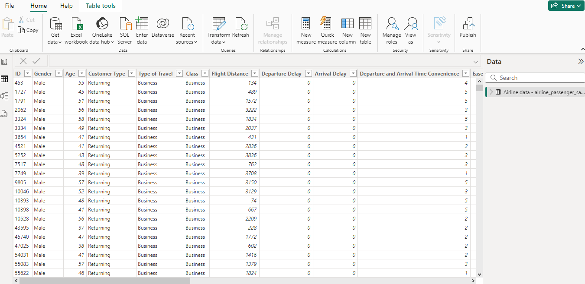
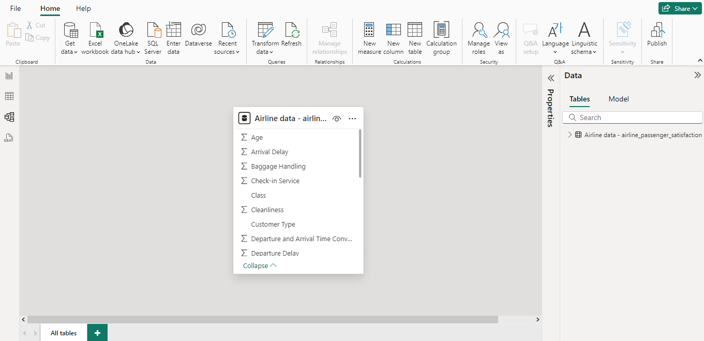
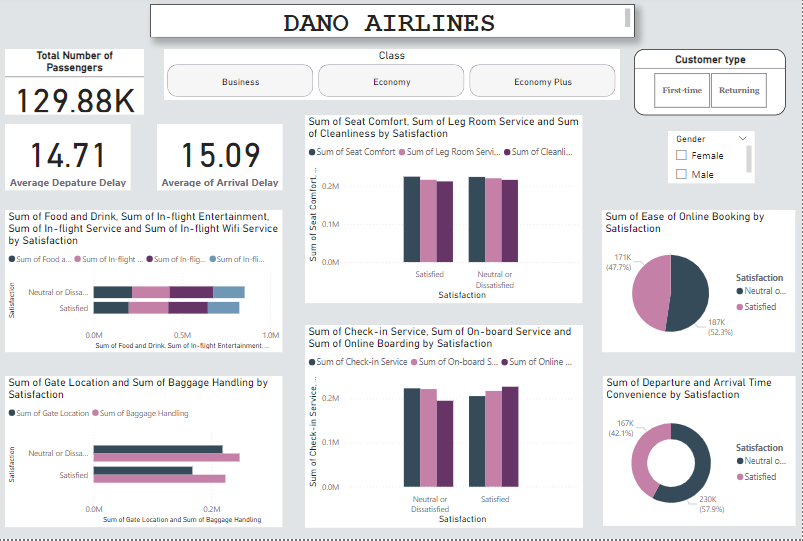
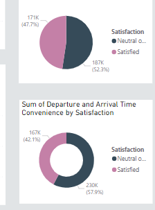
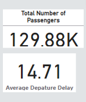
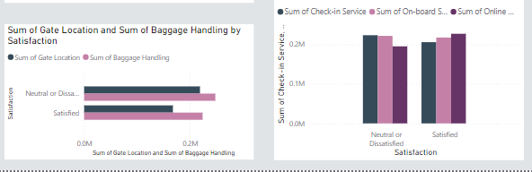
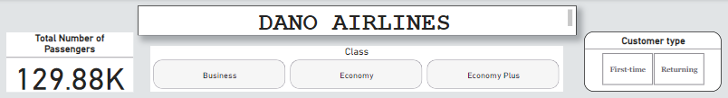

# Capstone 2

## Dano Airlines 

---

### Introduction

This is a power bi project to find and recommend a data-driven strategy for increasing Dano Airlines' satisfication rate to aid the leadership take good decision. 

### Problem Statement

Recommend a data-driven strategy for increasing Dano Airlines' satisfaction rate, and present it in the form of a single page report or dashboard.

### Skill/Concepts Demonstrated

The following skill/concept were incorporated:
- Power query
- Data modelling
- Data cleaning
- Data visualization

Transformed Table
:-------------------------:

### Data Sourcing
Digitately Drive (https://docs.google.com/spreadsheets/d/15Kp-2yfQFNRGJPNOkpMwG-OMX8xVZOJ5VL7f35v7sRQ/edit#gid=1647986900)

### Data Modelling

Model View
:---------------:

This model has just one fact table with 10 columns

### Visualisation 
The report comprises of 2 pages in the report view
1. Visualisation
   (https://drive.google.com/file/d/1vm5vAHW3kHejDzgPw2nPnjw5rD3_kriD/view?usp=drive_link)

The visuals report comprise of slicers, tables, cards, bar charts;
Pie Charts                 |    Cards                |   Bar charts
:-------------------------:|:-----------------------:|:---------------------:
        |           | 

Slicers            
:--------------------------------------:
 

Slicers - 
These are the main controllers of the visual. The narrow vast information to aid in getting more accurate answers for the problem statements

Tables - 
These visuals display large amount of data for which can be easily filtered for accurate results 

Cards - 
Display accurate numbers for the results against chosen slicers

Bar Charts - 
Provide changing but accurate results based off of values chosen in the slicers    

### Conclusion 

Dano Airlines has over 129,000 passengers which patronize their airline. Out of this total, over 62,000 of these passengers use the business class. Over 58,000 passengers which is less than the half of the grand total of passengers use the Economy class and 9,411 passengers use the Economy Plus class. 
After my analyzation. I came to the following conclusions:
Most Business class users are satisfied with the airline’s services; from the departure and arrive time, the ease of online booking, check in service, onboard service to online boarding service. Business class patrons are widely satisfied with locating Gates at the airport and how their baggage are handled. When it comes to In-plane services too, the Business class are widely or mostly satisfied with what they receive when it comes to the food and drink, in-flight entertainment, in-flight services and the in-flight Wi-Fi service. 90 percent of the Business class are returning customers. This means. The airline has 10 percent as first timers and with these first timers there is mostly a pattern of them being more dissatisfied with all other services as compared to the returners. 
Now with the Economy Plus Class, first timers are highly neutral or dissatisfied with all services; from the ease of online booking to departure and arrival time convenience to check-in times to onboarding to online boarding, to the in-flight comfortability and convenience to the food, in-flight entertainment, Wi-Fi Services, finding their gates, and the handling of their luggage. And when it comes to the returning Economy Plus class customers, which is 90 percent of the total Economy Plus Class, they are also highly dissatisfied or neutral with all services of the airline. 
To the last class, the Economy class, a great percentage are neutral or dissatisfied with all services, the airline provides First timers, which are over 13,000 passengers, are also highly neutral or dissatisfied with all services; from the online booking Wi-Fi Services to the comfortability of the seats to leg room to cleanliness. Returning passengers of the Economyclass were also highly neutral or dissatisfied.

### Recommendation

To even out Neutral and dissatisfied customers against satisfied customers. I believe the airline should focus more on the Economy and Economy Plus passengers. The airline should focus on improving all their services both classes; From the ease of online booking for both more male and female customers. They should be treated quite nicely. Departure and arrival times should be looked at and should be worked on. The airline should try as much as possible to make the seating in their aircraft for the economy and economy plus sections more comfortable and cleaned. Food, In-flight. entertainment and In-flight Wi-Fi services should be bettered at for the economy and economy plus passengers for a better flight experience. Make sure the location of gates is easy to find for all classes so as to have comfortable passengers. When it comes to checking in, I believe the airline should also create a prompt and easy way for passengers to quickly check in and on board. And also for their boarding should be looked at for easier boarding of the plane, I believe if all these things are looked at all passengers will be fairly satisfied evening out the dissatisfied to the satisfied ratio.
